# PorterDuffCompositing
Demonstrates different Porter/Duff compositing modes.

This implementation is purely in software and is slow and should be used for educational purposes only.

See also:

https://www.w3.org/TR/compositing-1/

http://ssp.impulsetrain.com/porterduff.html

https://developer.mozilla.org/en-US/docs/Web/API/Canvas_API/Tutorial/Compositing

------

Clear

SourceOnly

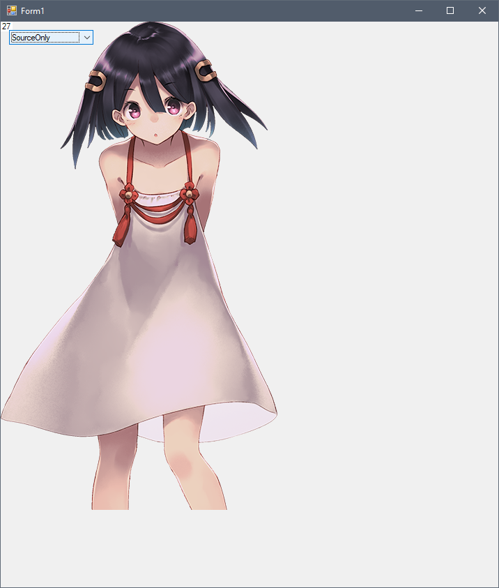

DestinationOnly

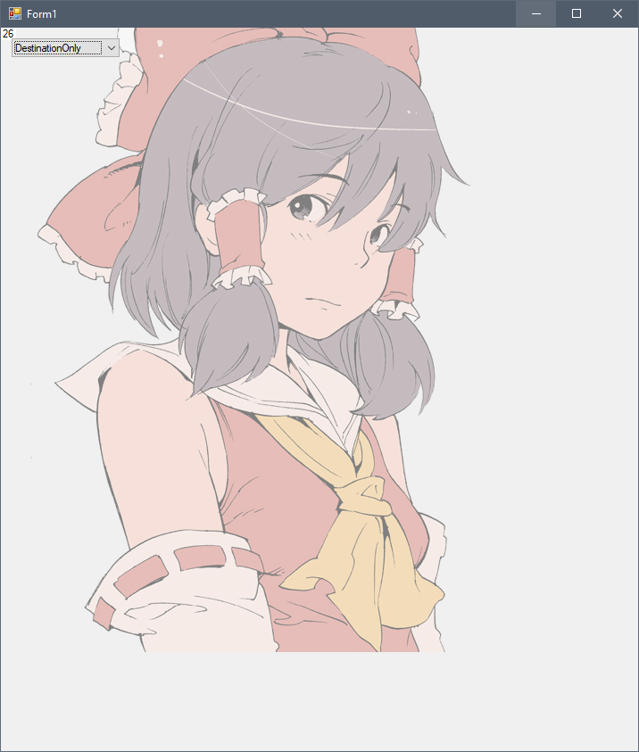

SourceOver

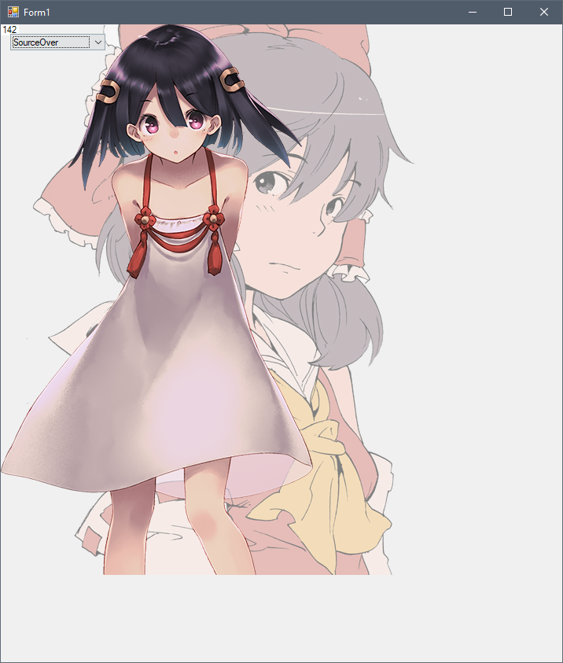

DestinationOver

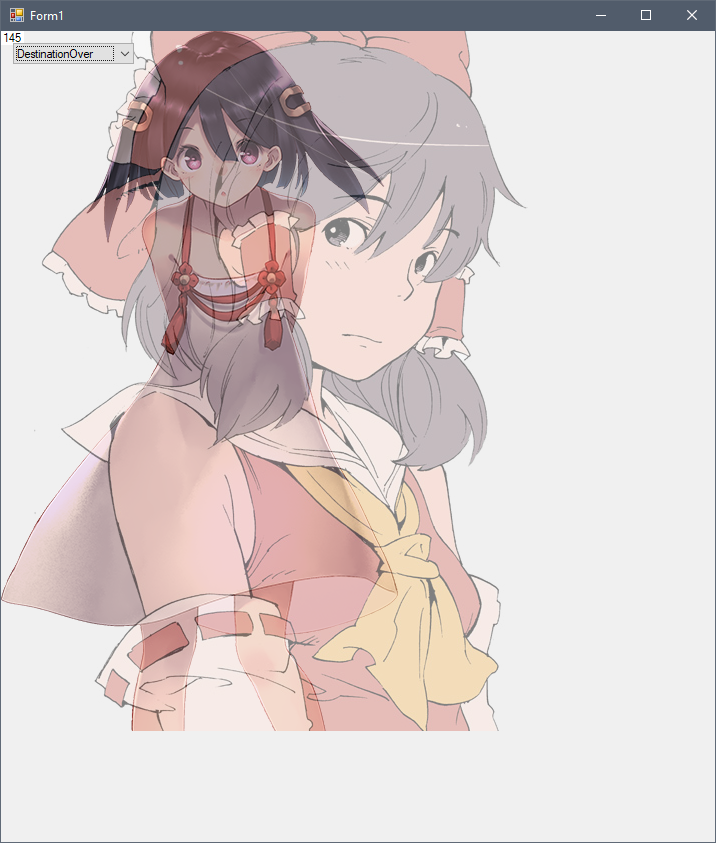

SourceIn

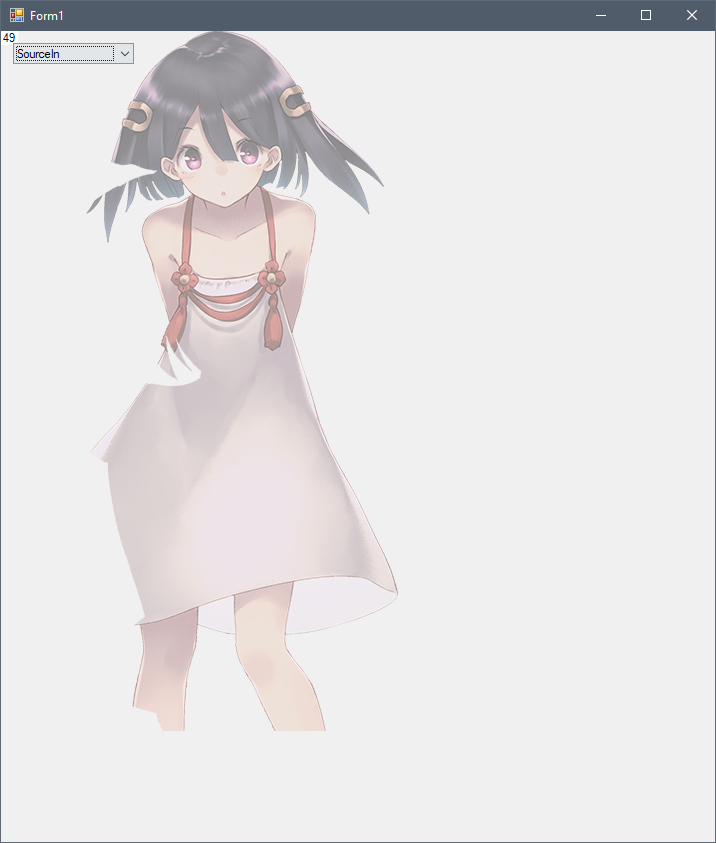

DestinationIn

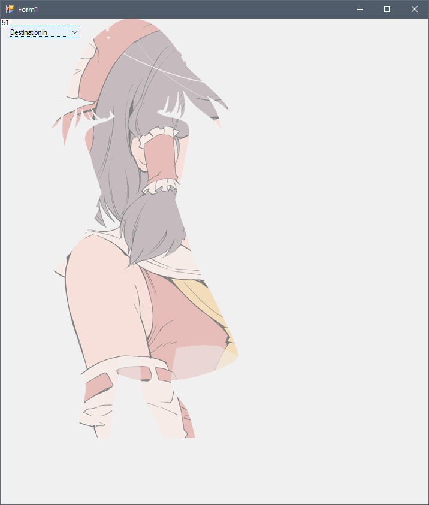

SourceOut

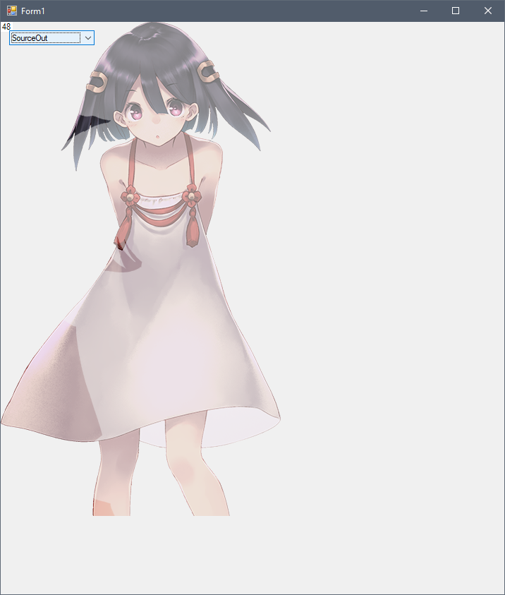

DestinationOut

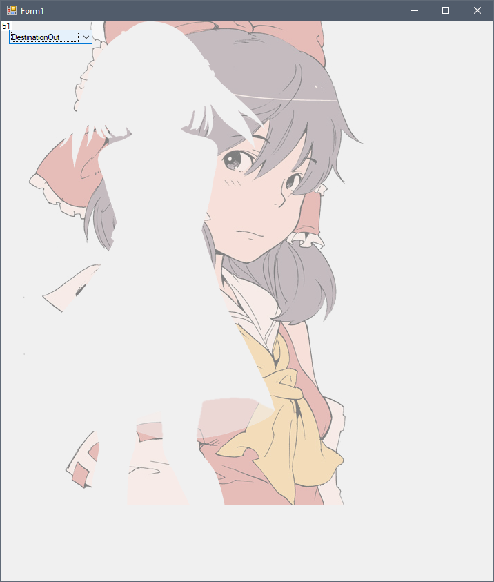

SourceAtop

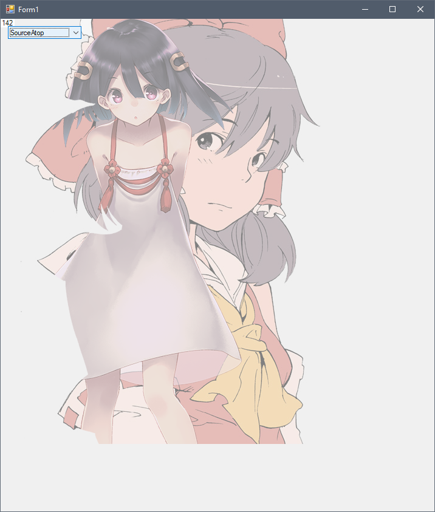

DestinationAtop

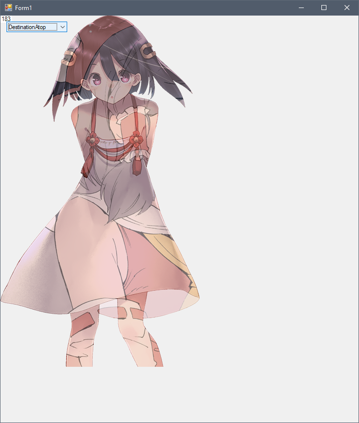

Xor

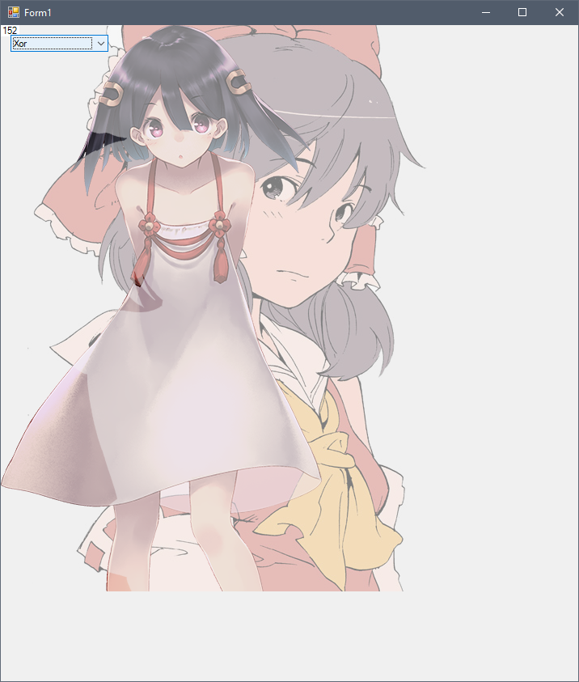
